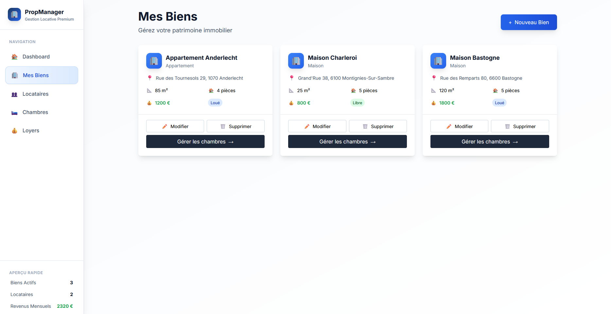

# PropManager

Gestion locative moderne, performante et typée.

## 📸 Aperçu

*Interface moderne pour la gestion de votre patrimoine immobilier*



> 💡 **Démo locale :** Ouvrez le fichier `demo.html` dans votre navigateur pour un aperçu interactif de l'interface.

## 🚧 Migration TypeScript en cours

**État actuel :** Le projet est en cours de migration vers TypeScript (actuellement ~5% TypeScript, 40% JavaScript).

**Objectif :** Migration complète vers TypeScript avec typage strict pour :

- ✅ **Qualité de code** : Détection d'erreurs à la compilation
- ✅ **Maintenabilité** : Code plus robuste et auto-documenté
- ✅ **Développement** : IntelliSense, refactoring sécurisé
- ✅ **Architecture** : Services, hooks et contextes typés

**Progression :**

- ✅ Configuration TypeScript + Vite
- ✅ Modèles de données typés (`src/types/models.ts`)
- ✅ Services typés (`src/services/`)
- ✅ Hooks personnalisés typés (`src/hooks/`)
- ✅ Contextes typés (`src/context/`)
- 🔄 Migration progressive des composants React
- 🔄 Migration du backend Express

> **Note :** Toutes les nouvelles contributions doivent être en TypeScript avec types explicites.

## Fonctionnalités principales

- Gestion des biens, chambres, locataires, loyers, contrats et factures
- Tableaux de bord financiers et statistiques
- Historique des loyers et activités
- Virtualisation des listes pour performance
- Validation et sécurité côté frontend et backend
- Architecture modulaire avec services, hooks et context typés

## Stack technique

- **React 18** + **TypeScript**
- **Vite** (build rapide)
- **Zustand** (state management)
- **Tailwind CSS** (UI moderne)
- **React-window** (virtualisation)
- **React-query** (caching, mutations)
- **Express** (API backend)

## Installation

```bash
# Clonez le repo
$ git clone https://github.com/matelot-pret/PropManager.git
$ cd PropManager

# Installez les dépendances
$ npm install

# Lancez le projet
$ npm run dev
```

## Documentation

- [Guide de bonnes pratiques](./best-practice.md)
- [Roadmap](./roadmap.md)

## Contribuer

### Prérequis

- Node.js ≥ 18, npm ≥ 9
- Connaissances React, TypeScript

### Étapes

1. Forkez le projet
2. Créez une branche : `git checkout -b feat/nom-fonctionnalite`
3. Développez avec `npm run dev`
4. Testez : `npm run test` et `npm run lint`
5. Commit : `feat: description claire`
6. Pull Request avec description détaillée

### Bonnes pratiques

- **Types explicites TypeScript obligatoires** pour toutes les nouvelles contributions
- **Migration progressive** : convertir JavaScript → TypeScript lors des modifications
- Hooks personnalisés pour la logique métier
- Séparation UI et logique métier
- Suivez le [guide de bonnes pratiques](./best-practice.md)

### Aide à la migration

- Consultez `src/types/models.ts` pour les types de base
- Utilisez les services typés comme modèles (`src/services/BienService.ts`)
- Référez-vous aux hooks typés (`src/hooks/useBiens.ts`)
- Questions ? Ouvrez une issue avec le tag `migration-typescript`

---

**PropManager** - Gestion locative moderne et typée 🚀
